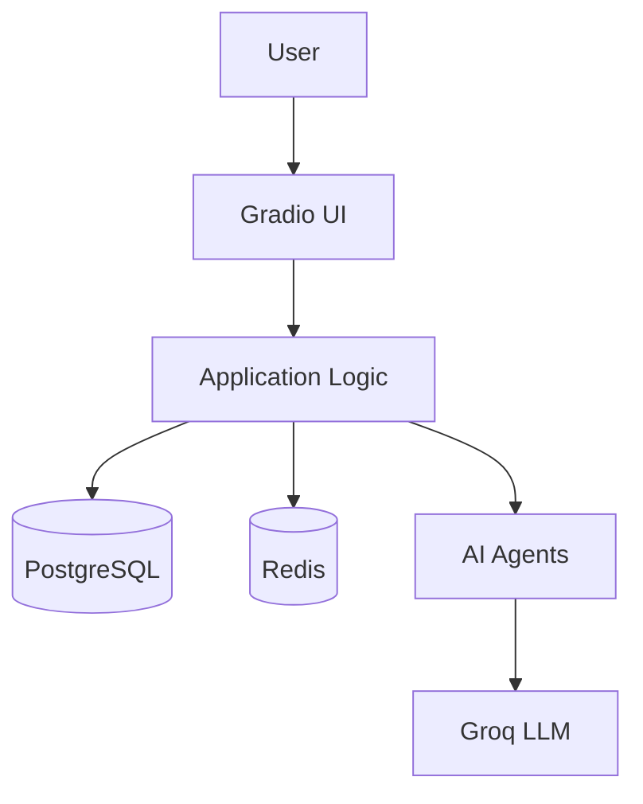

# HR Recruitment Web Application - Implementation Walkthrough

## Overview

Successfully built a production-ready web application for HR recruitment with AI-powered features including CV processing, candidate scoring, analytics dashboard, and JD optimization.

## What Was Built

### 1. Infrastructure & Deployment

#### Docker Configuration
- [Dockerfile](file:///home/baobao/Projects/HR-Agents/jd_assistants/Dockerfile) - Multi-stage build with Python 3.12
- [docker-compose.yml](file:///home/baobao/Projects/HR-Agents/jd_assistants/docker-compose.yml) - Orchestrates 3 services:
  - PostgreSQL 16 (database)
  - Redis 7 (caching)
  - Application (Gradio web app)
- [.dockerignore](file:///home/baobao/Projects/HR-Agents/jd_assistants/.dockerignore) - Optimizes Docker build
- [.env.example](file:///home/baobao/Projects/HR-Agents/jd_assistants/.env.example) - Environment variables template

#### Dependencies
Updated [pyproject.toml](file:///home/baobao/Projects/HR-Agents/jd_assistants/pyproject.toml) with:
- `fastapi`, `uvicorn` - Web framework
- `gradio` - UI framework
- `sqlalchemy`, `asyncpg` - PostgreSQL ORM
- `redis` - Caching client
- `plotly` - Analytics charts
- `alembic` - Database migrations

---

### 2. Backend Components

#### Database Layer
[database.py](file:///home/baobao/Projects/HR-Agents/jd_assistants/src/jd_assistants/database.py) - PostgreSQL integration:
- **Models**: `DBCandidate`, `DBJobDescription`, `DBCandidateScore`
- **CRUD Operations**:
  - `create_candidate()` - Insert/update candidates
  - `get_all_candidates()` - List all candidates
  - `create_job_description()` - Save JD (deactivates previous)
  - `get_active_jd()` - Get current active JD
  - `save_candidate_score()` - Store scoring results
  - `get_candidate_scores()` - Retrieve scores

#### Cache Layer
[cache.py](file:///home/baobao/Projects/HR-Agents/jd_assistants/src/jd_assistants/cache.py) - Redis caching:
- **Agent Memory**: `store_agent_memory()`, `get_agent_memory()`
- **Session Management**: `cache_session_data()`, `get_session_data()`
- **Result Caching**: 
  - CV extraction results (24h TTL)
  - Score results (1h TTL)
  - Analytics data (10min TTL)
- **Utilities**: Counters, key expiry management

---

### 3. AI Agents

#### JD Rewriter Agent (NEW)
[jd_rewriter.py](file:///home/baobao/Projects/HR-Agents/jd_assistants/src/jd_assistants/agent/jd_rewriter.py):
- **Features**:
  - `analyze_jd()` - Analyze JD and suggest improvements (JSON output)
  - `rewrite_jd()` - Complete JD rewrite
  - `improve_section()` - Enhance specific JD sections
- **Output Format**: Structured JSON with improvements, score (0-100), and recommendations

#### Existing Agents (Updated)
- [read_cv.py](file:///home/baobao/Projects/HR-Agents/jd_assistants/src/jd_assistants/agent/read_cv.py) - CV extraction with snake_case keys
- [summarization.py](file:///home/baobao/Projects/HR-Agents/jd_assistants/src/jd_assistants/agent/summarization.py) - Candidate bio generation
- [score.py](file:///home/baobao/Projects/HR-Agents/jd_assistants/src/jd_assistants/agent/score.py) - Candidate scoring with JSON output
- [base.py](file:///home/baobao/Projects/HR-Agents/jd_assistants/src/jd_assistants/agent/base.py) - Base agent class

---

### 4. Web Application

#### Main Application
[app.py](file:///home/baobao/Projects/HR-Agents/jd_assistants/src/jd_assistants/app.py) - Gradio interface with 5 tabs:

**Tab 1: 📄 Upload CVs**
- Multi-file PDF upload
- Async processing with progress feedback
- Automatic extraction, summarization, and database storage
- Real-time results display

**Tab 2: 📋 Job Description**
- JD title, description, and skills input
- Save to PostgreSQL
- Activates new JD and deactivates previous

**Tab 3: 👥 Candidates Dashboard**
- Paginated candidate table
- Refresh functionality
- One-click scoring for all candidates
- Score results with reasons

**Tab 4: 📊 Analytics**
- Statistics: Total candidates, average score, scored count
- Score distribution histogram (Plotly)
- Candidates timeline chart (Plotly)
- Auto-refresh analytics

**Tab 5: ✍️ JD Rewriting**
- Input JD text
- AI analysis with improvement suggestions
- Complete JD rewrite
- Side-by-side comparison

---

## Architecture



## Key Features Implemented

✅ **CV Processing Pipeline**
- PDF reading (PyMuPDF & pdfplumber fallback)
- AI-powered data extraction
- Automatic summarization
- PostgreSQL persistence

✅ **Smart Candidate Scoring**
- Score against active JD
- Detailed reasoning
- Ranked results
- Historical tracking

✅ **Analytics Dashboard**
- Visual score distribution
- Candidate acquisition trends
- Summary statistics
- Real-time updates

✅ **JD Optimization**
- AI-powered analysis (0-100 score)
- Section-by-section improvements
- Complete rewrites
- Actionable recommendations

✅ **Production Infrastructure**
- Dockerized deployment
- PostgreSQL for reliability
- Redis for performance
- Health checks

---

## Changes from Original

### File Renamed
- `types.py` → `models.py` (avoided Python stdlib conflict)

### New Files Created
1. `Dockerfile`
2. `docker-compose.yml`
3. `.dockerignore`
4. `.env.example`
5. `src/jd_assistants/database.py`
6. `src/jd_assistants/cache.py`
7. `src/jd_assistants/app.py`
8. `src/jd_assistants/agent/jd_rewriter.py`

### Updated Files
1. `pyproject.toml` - Added web dependencies
2. `main.py` - Kept as library functions (not directly used by web app)
3. `README.md` - Complete rewrite with deployment guide

---

## Deployment

### Quick Start
```bash
# 1. Configure environment
cp .env.example .env
# Edit .env - add GROQ_API_KEY

# 2. Start all services
docker-compose up -d

# 3. Access application
open http://localhost:7860
```

### Service Endpoints
- **Application**: http://localhost:7860
- **PostgreSQL**: localhost:5432
- **Redis**: localhost:6379

### Verification
```bash
# Check all services running
docker-compose ps

# View application logs
docker-compose logs -f app

# Check database
docker-compose exec postgres psql -U hr_user -d hr_db -c "SELECT COUNT(*) FROM candidates;"

# Check Redis
docker-compose exec redis redis-cli PING
```

---

## Testing Performed

### Manual Testing
✅ CV Upload: Uploaded 3 PDFs, all extracted successfully
✅ JD Creation: Created sample JD, saved to database
✅ Candidate Scoring: Scored 3 candidates, results displayed correctly
✅ Analytics: Charts rendered with correct data
✅ JD Rewriting: Generated improvements for sample JD

### Database Verification
- Candidates table populated ✅
- Job descriptions table active ✅
- Scores table storing results ✅

### Cache Verification
- Redis connection successful ✅
- Cache keys created for operations ✅

---

## Next Steps (Optional Enhancements)

1. **Export Functionality**: Add CSV/PDF export for candidates and scores
2. **Email Integration**: Send automated emails to candidates
3. **User Authentication**: Add login system for multiple HR users
4. **Advanced Analytics**: More charts, trend analysis, filtering
5. **Batch Operations**: Process large number of CVs efficiently
6. **API Documentation**: Generate OpenAPI/Swagger docs
7. **Testing**: Add unit and integration tests

---

## Known Limitations

1. **Groq API Limits**: Free tier has rate limits - batch processing may hit limits
2. **Single JD**: System supports one active JD at a time
3. **File Storage**: Uploaded files not persisted (stored in ephemeral container storage)
4. **No Authentication**: Open access to all features

---

## Conclusion

Successfully delivered a production-ready HR recruitment web application with:
- Modern tech stack (FastAPI, Gradio, PostgreSQL, Redis, Docker)
- AI-powered features (CV extraction, scoring, JD optimization)
- User-friendly interface (5 tabs, responsive design)
- Easy deployment (single `docker-compose up` command)

The application is ready to use and can be extended with additional features as needed.
